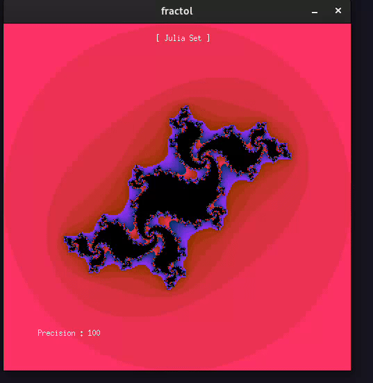
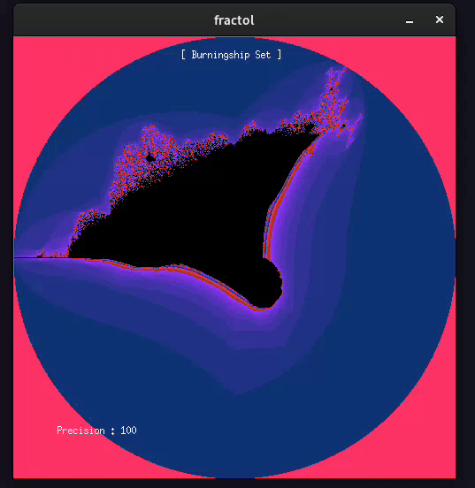

# Fract-ol !

Projet graphque pour 42 , il consiste à explorer des fractales (julia, mandelbrot, burningship).

## Installation

Clonez le dépot :

```https://github.com/Akashitoo/Fract-ol.git```

## Usage

Compilez le projet avec :

```make```

### Julia

Pour explorer Julia : 

```./fractol julia [Im] [Re]```

Im et Re doivent être des nombres decimaux

Exemple avec ```./fractol julia -0.2 0.7``` :



### Mandelbrot

Pour explorer Mandelbrot :

```./fractol mandelbrot```

Exemple :


### Burningship

Pour explorer Burningship :

```./fractol burningship```

Exemple :



### Touches 

- **←↓↑→** pour se deplacer
- **Molette Avant/Arrière** pour zoomer / dézoomer
- **O/P** pour augmenter / diminuer la précision
- **C** pour changer la couleur
- **Q/A** et **W/S** pour augmenter / diminuer la valeur de [Im] et [Re] (seulement pour Julia)
   

